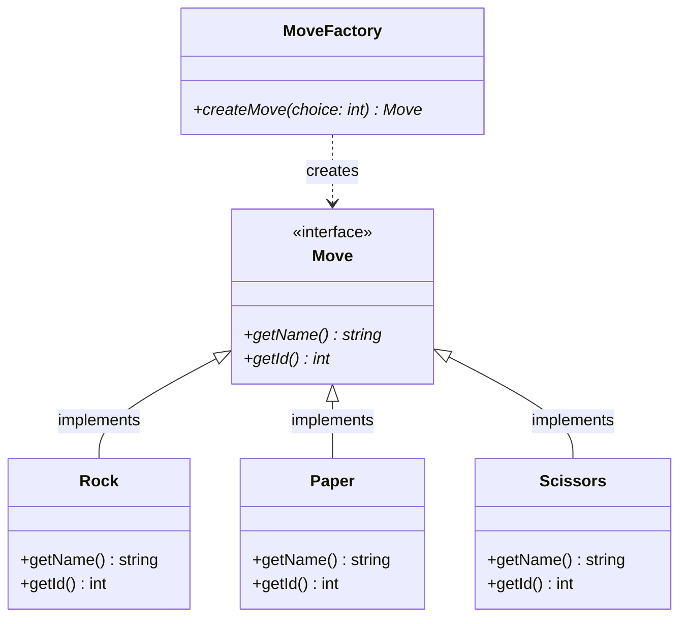
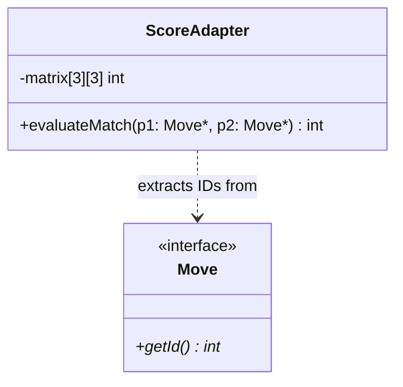
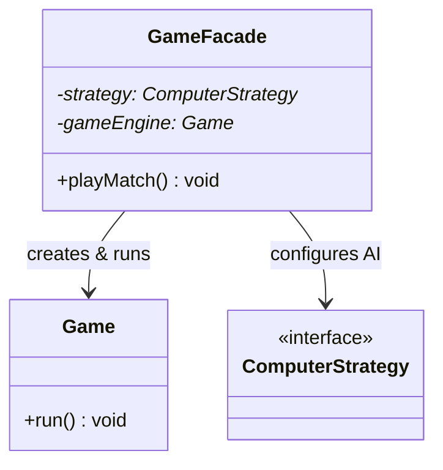

# C++ Rock Paper Scissors game

## UML Sınıf Diyagramları (Önce / Sonra)
### 1. Sonra (Faz 1 - Factory Method Sonrası)

```mermaid
classDiagram
    class Move {
        <<interface>>
        +getName() string*
        +getId() int*
    }
    class Rock {
        +getName() string
        +getId() int
    }
    class Paper {
        +getName() string
        +getId() int
    }
    class Scissors {
        +getName() string
        +getId() int
    }
    class MoveFactory {
        +createMove(choice: int) Move*
    }
    
    Move <|-- Rock : implements
    Move <|-- Paper : implements
    Move <|-- Scissors : implements
    MoveFactory ..> Move : creates
```

## 2. Structural Pattern: Adapter

```mermaid
classDiagram
    class ScoreAdapter {
        -matrix[3][3] int
        +evaluateMatch(p1: Move*, p2: Move*) int
    }
    class Move {
        <<interface>>
        +getId() int*
    }
    
    ScoreAdapter ..> Move : extracts IDs from
```
## 3. Structural Pattern: Facade

```mermaid
classDiagram
    class GameFacade {
        -strategy: ComputerStrategy*
        -gameEngine: Game*
        +playMatch() void
    }
    class Game {
        +run() void
    }
    class ComputerStrategy {
        <<interface>>
    }
    
    GameFacade --> Game : creates & runs
    GameFacade --> ComputerStrategy : configures AI
```
